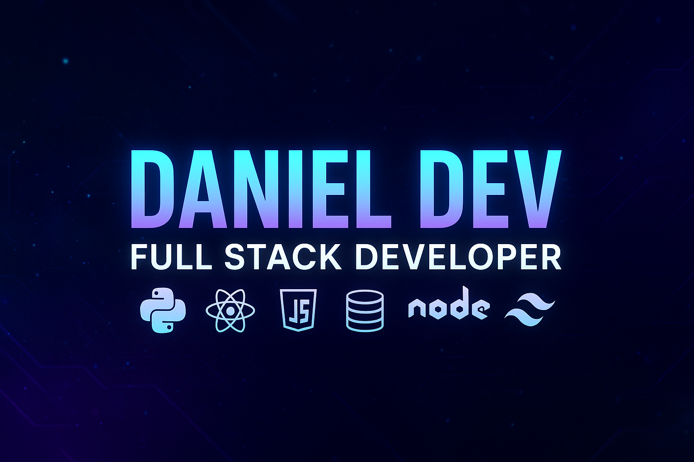

<!-- Banner -->

# 👋 ¡Hola! Soy **Daniel Dev**

💻 **Full Stack Developer** apasionado por la tecnología, la resolución de problemas y el aprendizaje continuo.  
Me encanta crear aplicaciones modernas, escalables y con interfaces atractivas, usando tecnologías de vanguardia. 🚀  

---

## 🧠 **Sobre mí**
- ⚙️ Me gusta construir software **eficiente, limpio y centrado en el usuario**.  
- 🤝 Disfruto colaborar en proyectos open source y aprender nuevas herramientas del ecosistema web.  

---

## 🚀 **Tecnologías y Herramientas**

### 🎨 **Frontend & Mobile**

---

### ⚙️ **Backend**

---

### 🛢 **Bases de Datos**

🧰 **Herramientas:** HeidiSQL · MySQL Workbench  

---

### ☁️ **Herramientas & Cloud**

---

## 📂 **Proyectos Destacados**
- 🌐 [Portafolio Web](https://github.com/DanielPOG/portfolio-website) – desarrollado con **Next.js** y **TailwindCSS**  
- 📚 [SGC](https://github.com/DanielPOG/SGC)  
- 🤖 [GapLy](https://github.com/xFeDEV/gaply)  
- 🚪 [Openix](https://github.com/G1lber/Proyecto-ControldeEntrada)

---

## 📫 **Conecta conmigo**

---

> ✨ _"El aprendizaje es un camino sin fin, y yo estoy listo para recorrerlo."_
